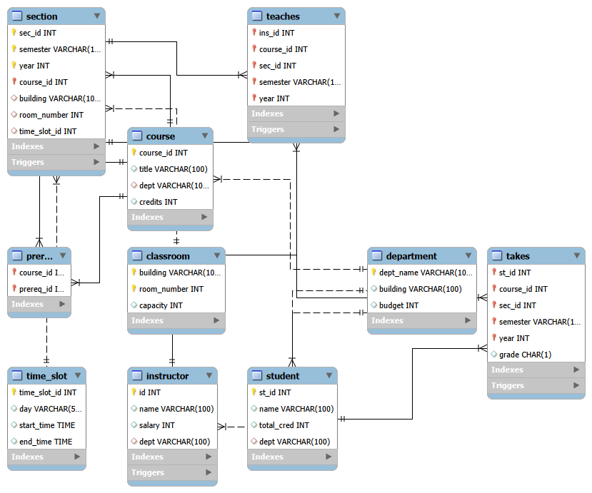

# University-Management-System
A MySQL-based system for managing students, courses, instructors, and enrollments with SQL features like triggers, views, and stored procedures.

## Features
- Database Schema Design
- ER Diagram
- Triggers
- Stored Procedures
- Views
- Constraints
- Sample Data

## Technologies Used
- MySQL

## Project Structure

```text
university-management-system/
│
├── university_management_system.sql
├── README.md
├── er_diagram.png
```

## ER Diagram



## Author
Sudip Bera
